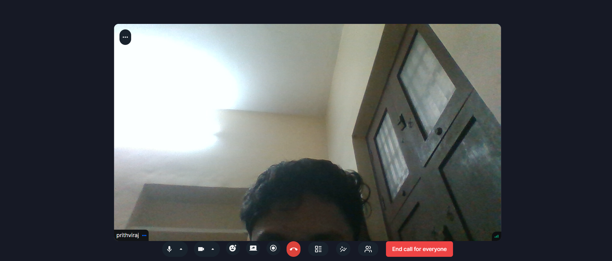

# QuickMeet: Video Conferencing Application

QuickMeet is a robust video conferencing platform, built using the latest technologies to provide a seamless, secure, and feature-rich meeting experience. Whether you're hosting or attending a meeting, QuickMeet offers a full suite of functionalities for effective communication, from recording sessions to managing participants.

This project leverages the power of Next.js and TypeScript for optimal performance and scalability.

## Features

- **Secure Authentication:** Users can log in securely using Clerk, with support for social sign-ons and traditional email/password methods.
- **New Meeting Creation:** Start a meeting instantly, with options to configure camera and microphone settings before joining.
- **Meeting Controls:** Manage various aspects of the meeting, including:
  - Recording
  - Screen sharing
  - Emoji reactions
  - Mute/unmute controls
  - Participant management (pinning, muting, blocking, etc.)
- **Join via Link:** Easily join meetings using a unique link shared by the meeting host.
- **Schedule Meetings:** Set up future meetings with date and time details, accessible through the 'Upcoming Meetings' section.
- **View Past Meetings:** Browse a history of previous meetings with full details and metadata.
- **Personal Room:** Every user has a personal meeting room with a unique link for instant, on-demand meetings.
- **Recorded Meetings:** Access and view recorded meetings for review or reference.
- **Responsive Design:** The UI is designed to work seamlessly across all device types, from desktops to mobile phones.

## Tech Stack

- **Framework:** Next.js
- **Language:** TypeScript
- **Authentication:** Clerk
- **Real-time Messaging:** getstream
- **UI Design:** Tailwind CSS, shadcn

### Cloning the Repository

Clone the repository using the following command:

```bash
git clone https://github.com/gitterrrr/Quickmeet-Video-Conferencing-Application-using-Next.js.git
```

## Getting Started

First, run the development server:

```bash
npm run dev
# or
yarn dev
# or
pnpm dev
# or
bun dev
```
## Deployment

The project has been deployed using Vercel and can be accessed through the following URL:

[QuickMeet Deployed Site](https://quickmeet-zeta.vercel.app/)

## Screenshots

Here are some screenshots of the Quickmeet video conferencing application:


*Home Page*


*Meeting Controls*


*Scheduled Meetings*


*Call Latency*

## License

This project is licensed under the MIT License - see the [LICENSE](LICENSE) file for details.

---


